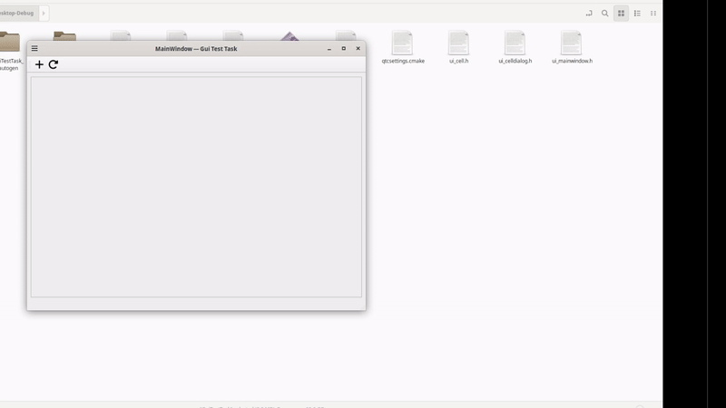

# GuiTestTask

Тестовое задание.

## Сборка

Написана на Qt 5.15.0. Для сборки необходимо создать директорию build и запустить cmake:

`cmake ..`

Сборка:

`cmake --build .`

При запуске на Windows возможно потребуется наличие библиотек Qt в папке запуска.

## Запуск

Добавление виджетов происходит через action на панели инструментов "+"; в открывшемся диалоговом окне нужно заполнить поля Name и Ip и нажать Ok. Действие "↺" удаляет все виджеты.

"##"